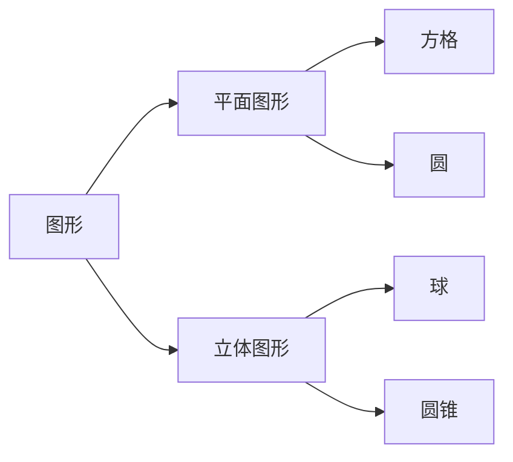
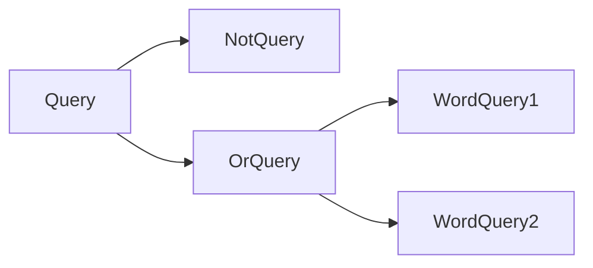
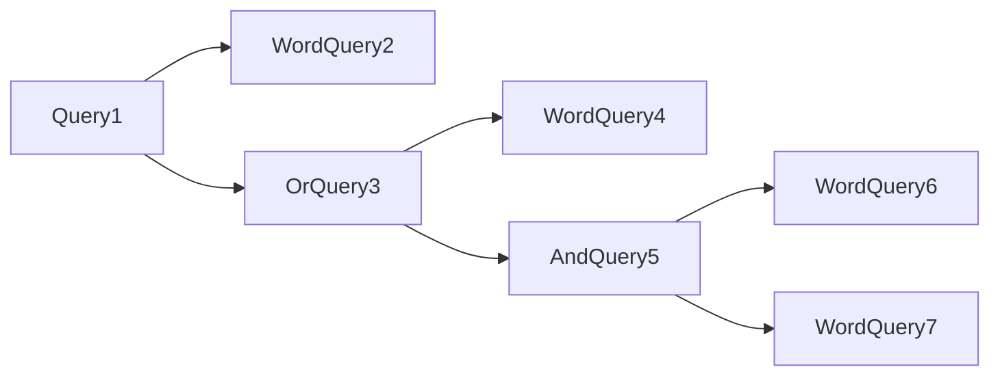

[toc]
### 15.1
基类希望其派生类进行覆盖的函数，称为虚函数。任何构造函数之外的非静态函数都可以是虚函数。
### 15.2
主要区别在于派生类的成员函数及其友元是否有其访问权限，protected说明符修饰的基类成员可以被派生类成员函数及其友元访问，同时禁止派生类用户访问。而private说明符修饰的基类成员不能被派生类成员函数及其友元访问，也禁止派生类用户访问。
### 15.3
<a id="1">Quote.h</a>
```
#ifndef _QUOTE_H
#define _QUOTE_H
#include <iostream>
#include <string>
class Quote
{
	public:
		Quote()=default;
		Quote(const std::string &book,double sales_price):price(sales_price),bookNo(book) {}
		std::string isbn() const {return bookNo;}
		virtual double net_price(std::size_t n) const {return n*price;}
		virtual std::string debug() const {return "bookNo="+bookNo+"\n"+"price="+std::to_string(price);}
		virtual ~Quote()=default;
	protected:
		double price=0.0;
	private:
		std::string bookNo;
};
double print_total(std::ostream &os,const Quote &item,std::size_t n);
class Bulk_quote:public Quote
{
	public:
		Bulk_quote()=default;
		Bulk_quote(const std::string &book,double sales_price,std::size_t qty,double disc):Quote(book,sales_price),min_qty(qty),discount(disc) {}
		virtual double net_price(std::size_t n) const override
		{
			if(n>=min_qty)
				return n*(1-discount)*price;
			else
				return n*price;
		}
		virtual std::string debug() const
		{
			return Quote::debug()+"\n"+"min_qty="+std::to_string(min_qty)+"\n"+"discount="+std::to_string(discount);
		}
	private:
		std::size_t min_qty=0;
		double discount=0.0;
};


class Limit_quote:public Quote
{
	public:
		Limit_quote()=default;
		Limit_quote(const std::string &book,double sales_price,std::size_t qty,double disc):Quote(book,sales_price),max_qty(qty),discount(disc) {}
		virtual double net_price(std::size_t n) const override
		{
			if(n<=max_qty)
				return n*(1-discount)*price;
			else
				return max_qty*(1-discount)*price+(n-max_qty)*price;
		}
		virtual std::string debug() const
		{
			return Quote::debug()+"\n"+"max_qty="+std::to_string(max_qty)+"\n"+"discount="+std::to_string(discount);
		}
	private:
		std::size_t max_qty=0;
		double discount=0.0;
};
#endif
```
==Quote.cpp==
```
#include "Quote.h"
double print_total(std::ostream &os,const Quote &item,std::size_t n)
{
	double ret=item.net_price(n);
	os<<"ISBN: "<<item.isbn()<<" # sold: "<<n<<" total due: "<<ret<<std::endl;
	return ret;
}
```
### 15.4
1. 错误，一个类不能派生它本身。
2. 正确。
3. 错误，派生类的声明中不可以包含它的派生列表。
### 15.5
[见15.3](#1)
### 15.6
```
#include <iostream>
#include "Quote.h"
using namespace std;
int main(void)
{
	Quote item1("1-102-333",20);
	Bulk_quote item2("1-202-222",30,2,0.2);
	print_total(cout,item1,3);
	print_total(cout,item2,3);
	return 0;
}
```
### 15.7
```
class Limit_quote:public Quote
{
	public:
		Limit_quote()=default;
		Limit_quote(const std::string &book,double sales_price,std::size_t qty,double disc):Quote(book,sales_price),max_qty(qty),discount(disc) {}
		virtual double net_price(std::size_t n) const override
		{
			if(n<=max_qty)
				return n*(1-discount)*price;
			else
				return max_qty*(1-discount)*price+(n-max_qty)*price;
		}
	private:
		std::size_t max_qty=0;
		double discount=0.0;
};
```
### 15.8
静态类型是变量声明时的类型或表达式生成的类型，动态类型则是变量或表达式表示的内存中的对象的类型，动态类型直到运行时才可知。
### 15.9
当基类的指针或引用指向派生类对象时，就会产生静态类型与动态类型不同的情况。
```
class base{......};
class derived:public base{......};
derived objd;
base *bp=&objd;//这三种情况静态类型与动态类型不同
base &bref=objd;//这三种情况静态类型与动态类型不同
base *bp=derived *dp=&objd;//这三种情况静态类型与动态类型不同
```
### 15.10
ifstream类型派生自istream类型,因此我们可以像使用istream对象一样使用ifstream对象。在read函数中，它接受一个istream类型的引用，所以作为它派生类,ifstream也可以绑定到istream的引用上。
### 15.11
[见15.3](#1)
### 15.12
有必要，override关键字指明该函数用于覆盖掉从基类继承而来的虚函数，这种用法可以避免我们在派生类中不经意间定义了一个与继承而来的虚函数同名但形参列表不同，而导致重新声明了一个与原虚函数相互独立的的函数的情况。而final关键字指明该函数不允许后续的派生类进行覆盖。这两个关键字功能并不重复，所以可以同时声明。
### 15.13
两个print函数的目的都是打印各自的数据成员，其中派生类的print函数，函数体中会对自身版本的print函数进行调用，从而导致无限递归。派生类中的print函数应该改为`void print(ostream &os) {base::print(os);os<<" "<<i;}`。
### 15.14
1. 基类版本
2. 派生类版本
3. 基类版本
4. 基类版本
5. 基类版本
6. 派生类版本
### 15.15
<a id="2">Quote.h</a>
```
#ifndef _QUOTE_H
#define _QUOTE_H
#include <iostream>
#include <string>
class Quote
{
	public:
		Quote()=default;
		Quote(const std::string &book,double sales_price):price(sales_price),bookNo(book) {}
		std::string isbn() const {return bookNo;}
		virtual double net_price(std::size_t n) const {return n*price;}
		virtual std::string debug() const {return "bookNo="+bookNo+"\n"+"price="+std::to_string(price);}
		virtual ~Quote()=default;
	protected:
		double price=0.0;
	private:
		std::string bookNo;
};
class Disc_quote:public Quote
{
	public:
		Disc_quote()=default;
		Disc_quote(const std::string &book,double sales_price,std::size_t qty,double disc):Quote(book,sales_price),quantity(qty),discount(disc) {}
		virtual double net_price(std::size_t n) const=0;
		virtual std::string debug() const override
		{
			return Quote::debug()+"\n"+"quantity="+std::to_string(quantity)+"\n"+"discount="+std::to_string(discount);
		}
	protected:
		std::size_t quantity=0;
		double discount=0.0;
};
double print_total(std::ostream &os,const Quote &item,std::size_t n);
class Bulk_quote:public Disc_quote
{
	public:
		Bulk_quote()=default;
		Bulk_quote(const std::string &book,double sales_price,std::size_t qty,double disc):Disc_quote(book,sales_price,qty,disc) {}
		virtual double net_price(std::size_t n) const override
		{
			if(n>=quantity)
				return n*(1-discount)*price;
			else
				return n*price;
		}
};
class Limit_quote:public Disc_quote
{
	public:
		Limit_quote()=default;
		Limit_quote(const std::string &book,double sales_price,std::size_t qty,double disc):Disc_quote(book,sales_price,qty,disc) {}
		virtual double net_price(std::size_t n) const override
		{
			if(n<=quantity)
				return n*(1-discount)*price;
			else
				return quantity*(1-discount)*price+(n-quantity)*price;
		}
};
#endif
```
==Quote.cpp==
```
#include "Quote.h"
double print_total(std::ostream &os,const Quote &item,std::size_t n)
{
	double ret=item.net_price(n);
	os<<"ISBN: "<<item.isbn()<<" # sold: "<<n<<" total due: "<<ret<<std::endl;
	return ret;
}
```
### 15.16
[见15.15](#2)
### 15.17
>>test.cpp:5:20: error: cannot declare variable ‘item’ to be of abstract type ‘Disc_quote’
### 15.18
`Base *p=&d1`合法
`p=&d2`不合法，在用户代码层面，私有继承的派生类的基类部分是不可访问的
`p=&d3`不合法，在用户代码层面，保护继承的派生类的基类部分是不可访问的
`p=&dd1`合法
`p=&dd2`不合法，基类部分不可访问
`p=&dd3`不合法，基类部分不可访问
### 15.19
`struct Derived_from_Private:public Priv_Derv`这个类中的memfcn不合法。
不论以何种方式继承，派生类的成员函数和友元都能使用派生类向基类的转换。派生类向其直接基类的类型转换对于派生类的成员和友元来说永远是可访问的。
如果派生类以公有或者受保护的方式继承，则派生类的派生类的成员和友元可以使用派生类向其基类的类型转换。如果以私有方式继承，则不能使用。
### 15.20
略
### 15.21

其中图形、平面图形及立体图形类都是抽象基类.
<a id="3">以后再写</a>
### 15.22
[见15.21](#3)
### 15.23
```
class D1:public Base
{
	public:
		int fcn();
		virtual void f2();
};
```
`bp2->fcn();`虚调用，将在运行时调用D1::fcn.
`p2->fcn(42);`错误，D1中没有一个接受int的fcn.
### 15.24
继承体系中的基类需要虚析构函数。虚析构函数可以在delete基类指针指向的派生类对象时，调用正确版本的析构函数。
### 15.25
编译器只有在发现类不包含任何构造函数的情况下才会替我们生成一个合成的默认构造函数，因为Disc_quote定义了其它的构造函数，所以不会自动生成一个合成的默认构造函数，如此一来它的派生类Bulk_quote也不能生成合成的默认构造函数。
### 15.26
==Quote.h==
```
#ifndef _QUOTE_H
#define _QUOTE_H
#include <iostream>
#include <string>
class Quote
{
	public:
		Quote()=default;
		Quote(const Quote &rhs):price(rhs.price),bookNo(rhs.bookNo) {std::cout<<"Quote copy constructor"<<std::endl;}
		Quote(Quote &&rhs) noexcept :price(rhs.price),bookNo(std::move(rhs.bookNo)) {std::cout<<"Quote move constructor"<<std::endl;}
		Quote & operator=(const Quote &rhs)
		{
			std::cout<<"Quote copy assignment operator"<<std::endl;
			price=rhs.price;
			bookNo=rhs.bookNo;
			return *this;
		}
		Quote & operator=(Quote &&rhs) noexcept
		{
			std::cout<<"Quote move assignment operator"<<std::endl;
			if(this!=&rhs)
			{
				price=rhs.price;
				bookNo=std::move(rhs.bookNo);
			}
			return *this;
		}
		Quote(const std::string &book,double sales_price):price(sales_price),bookNo(book) {}
		std::string isbn() const {return bookNo;}
		virtual double net_price(std::size_t n) const {return n*price;}
		virtual std::string debug() const {return "bookNo="+bookNo+"\n"+"price="+std::to_string(price);}
		virtual ~Quote()=default;
	protected:
		double price=0.0;
	private:
		std::string bookNo;
};
double print_total(std::ostream &os,const Quote &item,std::size_t n);
class Bulk_quote:public Quote
{
	public:
		Bulk_quote()=default;
		Bulk_quote(const std::string &book,double sales_price,std::size_t qty,double disc):Quote(book,sales_price),min_qty(qty),discount(disc) {}
		Bulk_quote(const Bulk_quote &rhs):Quote(rhs),min_qty(rhs.min_qty),discount(rhs.discount) {std::cout<<"Bulk_quote copy constructor"<<std::endl;}
		Bulk_quote(Bulk_quote &&rhs) noexcept : Quote(std::move(rhs)),min_qty(rhs.min_qty),discount(rhs.discount) {std::cout<<"Bulk_quote move constructor"<<std::endl;}
		Bulk_quote & operator=(const Bulk_quote &rhs)
		{
			std::cout<<"Bulk_quote copy assignment operator"<<std::endl;
			Quote::operator=(rhs);
			min_qty=rhs.min_qty;
			discount=rhs.discount;
			return *this;
		}
		Bulk_quote & operator=(Bulk_quote &&rhs) noexcept
		{
			std::cout<<"Bulk_quote move assignment operator"<<std::endl;
			if(this!=&rhs)
			{
				Quote::operator=(std::move(rhs));
				min_qty=rhs.min_qty;
				discount=rhs.discount;
			}
			return *this;
		}
		virtual double net_price(std::size_t n) const override
		{
			if(n>=min_qty)
				return n*(1-discount)*price;
			else
				return n*price;
		}
		virtual std::string debug() const
		{
			return Quote::debug()+"\n"+"min_qty="+std::to_string(min_qty)+"\n"+"discount="+std::to_string(discount);
		}
	private:
		std::size_t min_qty=0;
		double discount=0.0;
};
#endif
```
==Quote.cpp==
```
#include "Quote.h"
double print_total(std::ostream &os,const Quote &item,std::size_t n)
{
	double ret=item.net_price(n);
	os<<"ISBN: "<<item.isbn()<<" # sold: "<<n<<" total due: "<<ret<<std::endl;
	return ret;
}
```
==test.cpp==
```
#include <iostream>
#include "Quote.h"
int main(void)
{
	Bulk_quote bulk("10-11-222",30,5,0.2);
	Quote qu=bulk;
	qu=bulk;
	Bulk_quote qu1=bulk;
	qu1=bulk;
	qu1=std::move(bulk);
	return 0;
}
```
### 15.26
==Quote.h==
```
#ifndef _QUOTE_H
#define _QUOTE_H
#include <iostream>
#include <string>
class Quote
{
	public:
		Quote()=default;
		Quote(const std::string &book,double sales_price):price(sales_price),bookNo(book) {}
		std::string isbn() const {return bookNo;}
		virtual double net_price(std::size_t n) const {return n*price;}
		virtual std::string debug() const {return "bookNo="+bookNo+"\n"+"price="+std::to_string(price);}
		virtual ~Quote()=default;
	protected:
		double price=0.0;
	private:
		std::string bookNo;
};
class Disc_quote:public Quote
{
	public:
		Disc_quote()=default;
		Disc_quote(const std::string &book,double sales_price,std::size_t qty,double disc):Quote(book,sales_price),quantity(qty),discount(disc) {}
		virtual double net_price(std::size_t n) const=0;
		virtual std::string debug() const override
		{
			return Quote::debug()+"\n"+"quantity="+std::to_string(quantity)+"\n"+"discount="+std::to_string(discount);
		}
	protected:
		std::size_t quantity=0;
		double discount=0.0;
};
double print_total(std::ostream &os,const Quote &item,std::size_t n);
class Bulk_quote:public Disc_quote
{
	public:
		Bulk_quote()=default;
/*见此处*/	using Disc_quote::Disc::quote;
		virtual double net_price(std::size_t n) const override
		{
			if(n>=quantity)
				return n*(1-discount)*price;
			else
				return n*price;
		}
};
class Limit_quote:public Disc_quote
{
	public:
		Limit_quote()=default;
/*见此处*/	using Disc_quote::Disc::quote;
		virtual double net_price(std::size_t n) const override
		{
			if(n<=quantity)
				return n*(1-discount)*price;
			else
				return quantity*(1-discount)*price+(n-quantity)*price;
		}
};
#endif
```
### 15.28
<a id="4">test.cpp</a>
```
#include <iostream>
#include <vector>
#include <memory>
#include "Quote.h"
using namespace std;
int main(void)
{
	/*15.28*/
	vector<Quote> Qvec;
	Qvec.push_back(Quote("10-100-111",20));
	Qvec.push_back(Bulk_quote("11-100-222",30,5,0.2));
	cout<<Qvec[0].net_price(10)+Qvec[1].net_price(10)<<endl;
	/*15.29*/
	vector<shared_ptr<Quote>> Qpvec;
	Qpvec.push_back(make_shared<Quote>("10-100-111",20));
	Qpvec.push_back(make_shared<Bulk_quote>("11-100-222",30,5,0.2));
	cout<<Qpvec[0]->net_price(10)+Qpvec[1]->net_price(10)<<endl;
	return 0;
}
```
### 15.29
[见15.28](#4)
不一致，原因在于第一次的vector中所有的元素都是Quote类，即使传入的是Bulk_quote，它也是被忽略掉派生类部分，然后保存到一个Quote类中。而第二次vector由于保存的是基类的只能指针，所以指向的对象既有可能是基类，也有可能是派生类，如此一来在调用net_price时就可以调用到派生类的函数版本。
### 15.30
==Quote.h==
```
#ifndef _QUOTE_H
#define _QUOTE_H
#include <set>
#include <iostream>
#include <string>
#include <memory>
class Quote
{
	public:
		Quote()=default;
		Quote(const std::string &book,double sales_price):price(sales_price),bookNo(book) {}
		std::string isbn() const {return bookNo;}
		virtual double net_price(std::size_t n) const {return n*price;}
		virtual std::string debug() const {return "bookNo="+bookNo+"\n"+"price="+std::to_string(price);}
		virtual Quote * clone() const & {return new Quote(*this);}
		virtual Quote * clone() && {return new Quote(std::move(*this));}
		virtual ~Quote()=default;
	protected:
		double price=0.0;
	private:
		std::string bookNo;
};
class Disc_quote:public Quote
{
	public:
		Disc_quote()=default;
		Disc_quote(const std::string &book,double sales_price,std::size_t qty,double disc):Quote(book,sales_price),quantity(qty),discount(disc) {}
		virtual double net_price(std::size_t n) const=0;
		virtual std::string debug() const override
		{
			return Quote::debug()+"\n"+"quantity="+std::to_string(quantity)+"\n"+"discount="+std::to_string(discount);
		}
	protected:
		std::size_t quantity=0;
		double discount=0.0;
};
double print_total(std::ostream &os,const Quote &item,std::size_t n);
class Bulk_quote:public Disc_quote
{
	public:
		Bulk_quote()=default;
		Bulk_quote(const std::string &book,double sales_price,std::size_t qty,double disc):Disc_quote(book,sales_price,qty,disc) {}
		virtual double net_price(std::size_t n) const override
		{
			if(n>=quantity)
				return n*(1-discount)*price;
			else
				return n*price;
		}
		Bulk_quote * clone() const & {return new Bulk_quote(*this);}
		Bulk_quote * clone() && {return new Bulk_quote(std::move(*this));}
};
class Limit_quote:public Disc_quote
{
	public:
		Limit_quote()=default;
		Limit_quote(const std::string &book,double sales_price,std::size_t qty,double disc):Disc_quote(book,sales_price,qty,disc) {}
		virtual double net_price(std::size_t n) const override
		{
			if(n<=quantity)
				return n*(1-discount)*price;
			else
				return quantity*(1-discount)*price+(n-quantity)*price;
		}
};
class basket
{
	public:
		void add_item(const Quote &sale) {items.insert(std::shared_ptr<Quote>(sale.clone()));}
		void add_item(Quote &&sale) {items.insert(std::shared_ptr<Quote>(std::move(sale).clone()));}
		double total_receipt(std::ostream &os) const
		{
			double sum=0.0;
			for(std::multiset<std::shared_ptr<Quote>,decltype(compare) *>::const_iterator iter=items.cbegin();iter!=items.cend();iter=items.upper_bound(*iter))
				sum+=print_total(os,**iter,items.count(*iter));
			os<<"Total Sale: "<<sum<<std::endl;
			return sum;
		}
	private:
		static bool compare(const std::shared_ptr<Quote> &,const std::shared_ptr<Quote> &);
		std::multiset<std::shared_ptr<Quote>,decltype(compare) *> items{compare};
};
#endif
```
==Quote.cpp==
```
#include "Quote.h"
double print_total(std::ostream &os,const Quote &item,std::size_t n)
{
	double ret=item.net_price(n);
	os<<"ISBN: "<<item.isbn()<<" # sold: "<<n<<" total due: "<<ret<<std::endl;
	return ret;
}
bool basket::compare(const std::shared_ptr<Quote> &lhs,const std::shared_ptr<Quote> &rhs)
{
	return lhs->isbn()<rhs->isbn();
}
```
==test.cpp==
```
#include <iostream>
#include <vector>
#include <memory>
#include "Quote.h"
using namespace std;
int main(void)
{
	basket bsk;
	bsk.add_item(Quote("10-100-111",20));
	bsk.add_item(Bulk_quote("11-100-222",30,5,0.2));
	bsk.add_item(Bulk_quote("11-100-222",30,5,0.2));
	bsk.total_receipt(cout);
	return 0;
}
```
### 15.31
1.

2.
同上
3.

### 15.32
因为Query类未定义自己的控制成员函数，并且其只有一个shared_ptr类型的数据成员,所以Query类型的对象被拷贝、移动、赋值或销毁时，会调用shared_ptr类型相应的控制成员。
### 15.33
因为Query_base类是一个抽象基类，我们不能直接创建一个抽象基类的对象，实际上在它的派生类对象被创建时，它才会作为其基类部分被创建。同时它没有定义控制成员函数，又不含数据成员，所以它在被拷贝、移动、赋值或销毁时会执行默认语义，什么都不做。
### 15.34
1.
WordQuery(const std::string &) $\rightarrow$ fiery
Query(const std::string &) $\rightarrow$ fiery
WordQuery(const std::string &) $\rightarrow$ bird
Query(const std::string &) $\rightarrow$ bird
BinaryQuery(const Query &,const Query &,std::string) $\rightarrow$ (fiery,bird,&)
AndQuery(const Query &,const Query &) $\rightarrow$ (fiery,bird)
Query(std::shared_ptr<Query_base>)
WordQuery(const std::string &) $\rightarrow$ wind
Query(const std::string &) $\rightarrow$ wind
BinaryQuery(const Query &,const Query &,std::string) $\rightarrow$ ((fiery & bird),wind,|)
OrQuery(const Query &,const Query &) $\rightarrow$ ((fiery & bird),wind)
Query(std::shared_ptr<Query_base>)
2.
Query::rep
BinaryQuery::rep
Query::rep
WordQuery::rep
Query::rep
BinaryQuery::rep
Query::rep
WordQuery::rep
Query::rep
WordQuery::rep
3.
Query::eval
OrQuery::eval
Query::eval
WordQuery::eval
Query::eval
AndQuery::eval
Query::eval
WordQuery::eval
Query::eval
WordQuery::eval
### 15.35
```
class Query_base
{
	friend class Query;
	protected:
		using line_no=TextQuery::line_no;
		virtual ~Query_base()=default;
	private:
		virtual QueryResult eval(const TextQuery &) const=0;
		virtual std::string rep() const=0;
};
class Query
{
	friend Query operator~(const Query &);
	friend Query operator&(const Query &,const Query &);
	friend Query operator|(const Query &,const Query &);
	public:
		Query(const std::string &);
		QueryResult eval(const TextQuery &t) const {return q->eval(t);}
		std::string rep() const {return q->rep();}
	private:
		Query(std::shared_ptr<Query_base> query):q(query) {}
		std::shared_ptr<Query_base> q;
};
```
### 15.36
[参考15.39自行添加打印语句](#5)
### 15.37
仅把派生类中的Query类型数据成员改成shared_ptr<Query_base>类型成员的话，影响并不大，因为Query类本来就有接受智能指针的构造函数，必要的地方手动类型转换即可。
### 15.38
- 不合法，不能直接创建抽象基类的对象。
- 不合法，AndQuery没有接受Query参数的构造函数。
- 不合法，OrQuery没有接受Query参数的构造函数。
### 15.39
<a id="5">Query.h</a>
```
#ifndef _QUERY_H
#define _QUERY_H
#include <iostream>
#include <string>
#include <vector>
#include <map>
#include <set>
#include <memory>
#include <fstream>
class QueryResult;
class TextQuery
{
	public:
		using line_no=std::vector<std::string>::size_type;
		TextQuery(std::ifstream &);
		QueryResult query(const std::string &) const;
	private:
		std::shared_ptr<std::vector<std::string>> file;
		std::map<std::string,std::shared_ptr<std::set<line_no>>> wm;
};
class QueryResult
{
	friend std::ostream &print(std::ostream &,const QueryResult &);
	public:
		QueryResult(std::string s,std::shared_ptr<std::set<std::vector<std::string>::size_type>> l,std::shared_ptr<std::vector<std::string>> f):sought(s),lines(l),file(f){}
		std::set<std::vector<std::string>::size_type>::iterator begin() const {return lines->begin();}
		std::set<std::vector<std::string>::size_type>::iterator end() const {return lines->end();}
		std::shared_ptr<std::vector<std::string>> get_file(){return file;}
	private:
		std::string sought;
		std::shared_ptr<std::set<std::vector<std::string>::size_type>> lines;
		std::shared_ptr<std::vector<std::string>> file;
};
std::ostream &print(std::ostream &,const QueryResult &);
inline std::string make_plural(std::size_t count,const std::string &word,const std::string &ending)
{
	return (count>1)?word+ending:word;
}
class Query_base
{
	friend class Query;
	protected:
		using line_no=TextQuery::line_no;
		virtual ~Query_base()=default;
	private:
		virtual QueryResult eval(const TextQuery &) const=0;
		virtual std::string rep() const=0;
};
class Query
{
	friend Query operator~(const Query &);
	friend Query operator&(const Query &,const Query &);
	friend Query operator|(const Query &,const Query &);
	public:
		Query(const std::string &);
		QueryResult eval(const TextQuery &t) const {return q->eval(t);}
		std::string rep() const {return q->rep();}
	private:
		Query(std::shared_ptr<Query_base> query):q(query) {}
		std::shared_ptr<Query_base> q;
};
class WordQuery:public Query_base
{
	friend class Query;
	private:
		WordQuery(const std::string &s):query_word(s) {}
		virtual QueryResult eval(const TextQuery &t) const {return t.query(query_word);}
		virtual std::string rep() const {return query_word;}
		std::string query_word;
};

inline Query::Query(const std::string &s):q(new WordQuery(s)) {}

class NotQuery:public Query_base
{
	friend Query operator~(const Query &);
	private:
		NotQuery(const Query &q):query(q) {}
		virtual QueryResult eval(const TextQuery &) const;
		virtual std::string rep() const {return "~("+query.rep()+")";}
		Query query;
};
inline Query operator~(const Query &q) {return std::shared_ptr<Query_base>(new NotQuery(q));}
class BinaryQuery:public Query_base
{
	protected:
		BinaryQuery(const Query &left,const Query &right,const std::string &s):lhs(left),rhs(right),opSym(s) {}
		virtual std::string rep() const {return "("+lhs.rep()+" "+opSym+" "+rhs.rep()+")";}
		Query lhs,rhs;
		std::string opSym;
};
class AndQuery:public BinaryQuery
{
	friend Query operator&(const Query&,const Query&);
	private:
		AndQuery(const Query &left,const Query &right):BinaryQuery(left,right,"&") {}
		virtual QueryResult eval(const TextQuery &) const;
};
inline Query operator&(const Query &left,const Query &right) {return std::shared_ptr<Query_base>(new AndQuery(left,right));}
class OrQuery:public BinaryQuery
{
	friend Query operator|(const Query &,const Query &);
	private:
		OrQuery(const Query &left,const Query &right):BinaryQuery(left,right,"|") {}
		virtual QueryResult eval(const TextQuery &) const;
};
inline Query operator|(const Query &left,const Query &right) {return std::shared_ptr<Query_base>(new OrQuery(left,right));}
inline std::ostream & operator<<(std::ostream &os,const Query &q) {return os<<q.rep();}
#endif
```
==Query.cpp==
```
#include <sstream>
#include <algorithm>
#include <cctype>
#include "Query.h"
TextQuery::TextQuery(std::ifstream &infile):file(new std::vector<std::string>)
{
	std::string text;
	while(getline(infile,text))
	{
		file->push_back(text);
		std::size_t line_number=file->size()-1;
		std::istringstream line(text);
		std::string word;
		while(line>>word)
		{
			std::string key_word;
			for(auto c:word)
			{
				if(!ispunct(c))
					key_word+=c;
			}
			std::shared_ptr<std::set<line_no>> &lines=wm[key_word];
			if(!lines)
				lines.reset(new std::set<line_no>);
			lines->insert(line_number);
		}
	}
}
QueryResult TextQuery::query(const std::string &sought) const
{
	static std::shared_ptr<std::set<line_no>> nodata(new std::set<line_no>);
	std::map<std::string,std::shared_ptr<std::set<line_no>>>::const_iterator map_it=wm.find(sought);
	if(map_it==wm.end())
		return QueryResult(sought,nodata,file);
	else
		return QueryResult(sought,map_it->second,file);
}

std::ostream &print(std::ostream &os,const QueryResult &qr)
{
	os<<"Executing Query for: "<<qr.sought<<std::endl;
	os<<qr.sought<<" occurs "<<qr.lines->size()<<" "<<make_plural(qr.lines->size(),"time","s")<<std::endl;
	for(auto num:*(qr.lines))
		os<<"\t(line "<<num+1<<") "<<*(qr.file->begin()+num)<<std::endl;
	return os;
}
QueryResult NotQuery::eval(const TextQuery &text) const
{
	auto result=query.eval(text);
	auto beg=result.begin(),end=result.end();
	auto ret_lines=std::make_shared<std::set<line_no>>();
	auto sz=result.get_file()->size();
	for(std::size_t n=0;n!=sz;++n)
	{
		if(beg==end||*beg!=n)
			ret_lines->insert(n);
		else if(beg!=end)
			++beg;
	}
	return QueryResult(rep(),ret_lines,result.get_file());
}
QueryResult OrQuery::eval(const TextQuery &text) const
{
	auto left=lhs.eval(text),right=rhs.eval(text);
	auto ret_lines=std::make_shared<std::set<line_no>>(left.begin(),left.end());
	ret_lines->insert(right.begin(),right.end());
	return QueryResult(rep(),ret_lines,left.get_file());
}
QueryResult AndQuery::eval(const TextQuery &text) const
{
	auto left=lhs.eval(text),right=rhs.eval(text);
	auto ret_lines=std::make_shared<std::set<line_no>>();
	set_intersection(left.begin(),left.end(),right.begin(),right.end(),inserter(*ret_lines,ret_lines->begin()));
	return QueryResult(rep(),ret_lines,left.get_file());
}
```
==test.cpp==
```
#include <fstream>
#include "Query.h"
using namespace std;
int main(int argc,char *argv[])
{
	ifstream infile(argv[1]);
	TextQuery text(infile);
	Query q=Query("fiery")&Query("bird")|Query("wind");
	print(cout,q.eval(text));
	return 0;
}
```
### 15.40
set的构造函数和insert成员函数都可以正确处理空范围的情况，这种情况下得到的QueryResult的lines成员指向的set也将是空的。
### 15.41
==Query.h==
```
#ifndef _QUERY_H
#define _QUERY_H
#include <iostream>
#include <string>
#include <vector>
#include <map>
#include <set>
#include <memory>
#include <fstream>
class QueryResult;
class TextQuery
{
	public:
		using line_no=std::vector<std::string>::size_type;
		TextQuery(std::ifstream &);
		QueryResult query(const std::string &) const;
	private:
		std::shared_ptr<std::vector<std::string>> file;
		std::map<std::string,std::shared_ptr<std::set<line_no>>> wm;
};
class QueryResult
{
	friend std::ostream &print(std::ostream &,const QueryResult &);
	public:
		QueryResult(std::string s,std::shared_ptr<std::set<std::vector<std::string>::size_type>> l,std::shared_ptr<std::vector<std::string>> f):sought(s),lines(l),file(f){}
		std::set<std::vector<std::string>::size_type>::iterator begin() const {return lines->begin();}
		std::set<std::vector<std::string>::size_type>::iterator end() const {return lines->end();}
		std::shared_ptr<std::vector<std::string>> get_file(){return file;}
	private:
		std::string sought;
		std::shared_ptr<std::set<std::vector<std::string>::size_type>> lines;
		std::shared_ptr<std::vector<std::string>> file;
};
std::ostream &print(std::ostream &,const QueryResult &);
inline std::string make_plural(std::size_t count,const std::string &word,const std::string &ending)
{
	return (count>1)?word+ending:word;
}
class Query_base
{
	friend class Query;
	protected:
		using line_no=TextQuery::line_no;
		virtual ~Query_base()=default;
	private:
		virtual QueryResult eval(const TextQuery &) const=0;
		virtual std::string rep() const=0;
};
class Query
{
	friend Query operator~(const Query &);
	friend Query operator&(const Query &,const Query &);
	friend Query operator|(const Query &,const Query &);
	public:
		Query(const std::string &);
		
		Query(const Query &rhs):q(rhs.q),reference_count(rhs.reference_count) {++*reference_count;}
		Query & operator=(const Query &);
		~Query();

		QueryResult eval(const TextQuery &t) const {return q->eval(t);}
		std::string rep() const {return q->rep();}
	private:
		Query(Query_base *query):q(query),reference_count(new std::size_t(1)) {}
		Query_base *q;
		std::size_t *reference_count;
};
class WordQuery:public Query_base
{
	friend class Query;
	private:
		WordQuery(const std::string &s):query_word(s) {}
		virtual QueryResult eval(const TextQuery &t) const {return t.query(query_word);}
		virtual std::string rep() const {return query_word;}
		std::string query_word;
};

inline Query::Query(const std::string &s):q(new WordQuery(s)),reference_count(new std::size_t(1)) {}

class NotQuery:public Query_base
{
	friend Query operator~(const Query &);
	private:
		NotQuery(const Query &q):query(q) {}
		virtual QueryResult eval(const TextQuery &) const;
		virtual std::string rep() const {return "~("+query.rep()+")";}
		Query query;
};
inline Query operator~(const Query &q) {return new NotQuery(q);}
class BinaryQuery:public Query_base
{
	protected:
		BinaryQuery(const Query &left,const Query &right,const std::string &s):lhs(left),rhs(right),opSym(s) {}
		virtual std::string rep() const {return "("+lhs.rep()+" "+opSym+" "+rhs.rep()+")";}
		Query lhs,rhs;
		std::string opSym;
};
class AndQuery:public BinaryQuery
{
	friend Query operator&(const Query&,const Query&);
	private:
		AndQuery(const Query &left,const Query &right):BinaryQuery(left,right,"&") {}
		virtual QueryResult eval(const TextQuery &) const;
};
inline Query operator&(const Query &left,const Query &right) {return new AndQuery(left,right);}
class OrQuery:public BinaryQuery
{
	friend Query operator|(const Query &,const Query &);
	private:
		OrQuery(const Query &left,const Query &right):BinaryQuery(left,right,"|") {}
		virtual QueryResult eval(const TextQuery &) const;
};
inline Query operator|(const Query &left,const Query &right) {return new OrQuery(left,right);}
inline std::ostream & operator<<(std::ostream &os,const Query &q) {return os<<q.rep();}
#endif
```
==Query.cpp==
```
#include <sstream>
#include <algorithm>
#include <cctype>
#include "Query.h"
TextQuery::TextQuery(std::ifstream &infile):file(new std::vector<std::string>)
{
	std::string text;
	while(getline(infile,text))
	{
		file->push_back(text);
		std::size_t line_number=file->size()-1;
		std::istringstream line(text);
		std::string word;
		while(line>>word)
		{
			std::string key_word;
			for(auto c:word)
			{
				if(!ispunct(c))
					key_word+=c;
			}
			std::shared_ptr<std::set<line_no>> &lines=wm[key_word];
			if(!lines)
				lines.reset(new std::set<line_no>);
			lines->insert(line_number);
		}
	}
}
QueryResult TextQuery::query(const std::string &sought) const
{
	static std::shared_ptr<std::set<line_no>> nodata(new std::set<line_no>);
	std::map<std::string,std::shared_ptr<std::set<line_no>>>::const_iterator map_it=wm.find(sought);
	if(map_it==wm.end())
		return QueryResult(sought,nodata,file);
	else
		return QueryResult(sought,map_it->second,file);
}

std::ostream &print(std::ostream &os,const QueryResult &qr)
{
	os<<"Executing Query for: "<<qr.sought<<std::endl;
	os<<qr.sought<<" occurs "<<qr.lines->size()<<" "<<make_plural(qr.lines->size(),"time","s")<<std::endl;
	for(auto num:*(qr.lines))
		os<<"\t(line "<<num+1<<") "<<*(qr.file->begin()+num)<<std::endl;
	return os;
}
Query & Query::operator=(const Query &rhs)
{
	++*rhs.reference_count;
	if(--*reference_count==0)
	{
		delete q;
		delete reference_count;
	}
	q=rhs.q;
	reference_count=rhs.reference_count;
	return *this;
}
Query::~Query()
{
	if(--*reference_count==0)
	{
		delete q;
		delete reference_count;
	}
}
QueryResult NotQuery::eval(const TextQuery &text) const
{
	auto result=query.eval(text);
	auto beg=result.begin(),end=result.end();
	auto ret_lines=std::make_shared<std::set<line_no>>();
	auto sz=result.get_file()->size();
	for(std::size_t n=0;n!=sz;++n)
	{
		if(beg==end||*beg!=n)
			ret_lines->insert(n);
		else if(beg!=end)
			++beg;
	}
	return QueryResult(rep(),ret_lines,result.get_file());
}
QueryResult OrQuery::eval(const TextQuery &text) const
{
	auto left=lhs.eval(text),right=rhs.eval(text);
	auto ret_lines=std::make_shared<std::set<line_no>>(left.begin(),left.end());
	ret_lines->insert(right.begin(),right.end());
	return QueryResult(rep(),ret_lines,left.get_file());
}
QueryResult AndQuery::eval(const TextQuery &text) const
{
	auto left=lhs.eval(text),right=rhs.eval(text);
	auto ret_lines=std::make_shared<std::set<line_no>>();
	set_intersection(left.begin(),left.end(),right.begin(),right.end(),inserter(*ret_lines,ret_lines->begin()));
	return QueryResult(rep(),ret_lines,left.get_file());
}
```
### 15.42
按句子查询并打印单词，而不再是按行打印。
==Query.h==
```
#ifndef _QUERY_H
#define _QUERY_H
#include <iostream>
#include <string>
#include <vector>
#include <map>
#include <set>
#include <memory>
#include <fstream>
class QueryResult;
class TextQuery
{
	public:
		using line_no=std::vector<std::string>::size_type;
		TextQuery(std::ifstream &);
		QueryResult query(const std::string &) const;
	private:
		std::shared_ptr<std::vector<std::string>> file;
		std::map<std::string,std::shared_ptr<std::set<line_no>>> wm;
};
class QueryResult
{
	friend std::ostream &print(std::ostream &,const QueryResult &);
	public:
		QueryResult(std::string s,std::shared_ptr<std::set<std::vector<std::string>::size_type>> l,std::shared_ptr<std::vector<std::string>> f):sought(s),lines(l),file(f){}
		std::set<std::vector<std::string>::size_type>::iterator begin() const {return lines->begin();}
		std::set<std::vector<std::string>::size_type>::iterator end() const {return lines->end();}
		std::shared_ptr<std::vector<std::string>> get_file(){return file;}
	private:
		std::string sought;
		std::shared_ptr<std::set<std::vector<std::string>::size_type>> lines;
		std::shared_ptr<std::vector<std::string>> file;
};
std::ostream &print(std::ostream &,const QueryResult &);
inline std::string make_plural(std::size_t count,const std::string &word,const std::string &ending)
{
	return (count>1)?word+ending:word;
}
class Query_base
{
	friend class Query;
	protected:
		using line_no=TextQuery::line_no;
		virtual ~Query_base()=default;
	private:
		virtual QueryResult eval(const TextQuery &) const=0;
		virtual std::string rep() const=0;
};
class Query
{
	friend Query operator~(const Query &);
	friend Query operator&(const Query &,const Query &);
	friend Query operator|(const Query &,const Query &);
	public:
		Query(const std::string &);
		
		Query(const Query &rhs):q(rhs.q),reference_count(rhs.reference_count) {++*reference_count;}
		Query & operator=(const Query &);
		~Query();

		QueryResult eval(const TextQuery &t) const {return q->eval(t);}
		std::string rep() const {return q->rep();}
	private:
		Query(Query_base *query):q(query),reference_count(new std::size_t(1)) {}
		Query_base *q;
		std::size_t *reference_count;
};
class WordQuery:public Query_base
{
	friend class Query;
	private:
		WordQuery(const std::string &s):query_word(s) {}
		virtual QueryResult eval(const TextQuery &t) const {return t.query(query_word);}
		virtual std::string rep() const {return query_word;}
		std::string query_word;
};

inline Query::Query(const std::string &s):q(new WordQuery(s)),reference_count(new std::size_t(1)) {}

class NotQuery:public Query_base
{
	friend Query operator~(const Query &);
	private:
		NotQuery(const Query &q):query(q) {}
		virtual QueryResult eval(const TextQuery &) const;
		virtual std::string rep() const {return "~("+query.rep()+")";}
		Query query;
};
inline Query operator~(const Query &q) {return new NotQuery(q);}
class BinaryQuery:public Query_base
{
	protected:
		BinaryQuery(const Query &left,const Query &right,const std::string &s):lhs(left),rhs(right),opSym(s) {}
		virtual std::string rep() const {return "("+lhs.rep()+" "+opSym+" "+rhs.rep()+")";}
		Query lhs,rhs;
		std::string opSym;
};
class AndQuery:public BinaryQuery
{
	friend Query operator&(const Query&,const Query&);
	private:
		AndQuery(const Query &left,const Query &right):BinaryQuery(left,right,"&") {}
		virtual QueryResult eval(const TextQuery &) const;
};
inline Query operator&(const Query &left,const Query &right) {return new AndQuery(left,right);}
class OrQuery:public BinaryQuery
{
	friend Query operator|(const Query &,const Query &);
	private:
		OrQuery(const Query &left,const Query &right):BinaryQuery(left,right,"|") {}
		virtual QueryResult eval(const TextQuery &) const;
};
inline Query operator|(const Query &left,const Query &right) {return new OrQuery(left,right);}
inline std::ostream & operator<<(std::ostream &os,const Query &q) {return os<<q.rep();}
#endif
```
==Query.cpp==
```
#include <sstream>
#include <algorithm>
#include <cctype>
#include "Query.h"
TextQuery::TextQuery(std::ifstream &infile):file(new std::vector<std::string>)
{
	std::string text;
	while(getline(infile,text,'.'))
	{
		for(decltype(text.size()) index=0;index!=text.size();++index)
		{
			if(text[index]=='\n')
				text[index]=' ';
		}
		file->push_back(text);
		std::size_t line_number=file->size()-1;
		std::istringstream line(text);
		std::string word;
		while(line>>word)
		{
			std::string key_word;
			for(auto c:word)
			{
				if(!ispunct(c))
					key_word+=c;
			}
			std::shared_ptr<std::set<line_no>> &lines=wm[key_word];
			if(!lines)
				lines.reset(new std::set<line_no>);
			lines->insert(line_number);
		}
	}
}
QueryResult TextQuery::query(const std::string &sought) const
{
	static std::shared_ptr<std::set<line_no>> nodata(new std::set<line_no>);
	std::map<std::string,std::shared_ptr<std::set<line_no>>>::const_iterator map_it=wm.find(sought);
	if(map_it==wm.end())
		return QueryResult(sought,nodata,file);
	else
		return QueryResult(sought,map_it->second,file);
}

std::ostream &print(std::ostream &os,const QueryResult &qr)
{
	os<<"Executing Query for: "<<qr.sought<<std::endl;
	os<<qr.sought<<" occurs "<<qr.lines->size()<<" "<<make_plural(qr.lines->size(),"time","s")<<std::endl;
	for(auto num:*(qr.lines))
		os<<"\t(sentence "<<num+1<<") "<<*(qr.file->begin()+num)<<"."<<std::endl;
	return os;
}
Query & Query::operator=(const Query &rhs)
{
	++*rhs.reference_count;
	if(--*reference_count==0)
	{
		delete q;
		delete reference_count;
	}
	q=rhs.q;
	reference_count=rhs.reference_count;
	return *this;
}
Query::~Query()
{
	if(--*reference_count==0)
	{
		delete q;
		delete reference_count;
	}
}
QueryResult NotQuery::eval(const TextQuery &text) const
{
	auto result=query.eval(text);
	auto beg=result.begin(),end=result.end();
	auto ret_lines=std::make_shared<std::set<line_no>>();
	auto sz=result.get_file()->size();
	for(std::size_t n=0;n!=sz;++n)
	{
		if(beg==end||*beg!=n)
			ret_lines->insert(n);
		else if(beg!=end)
			++beg;
	}
	return QueryResult(rep(),ret_lines,result.get_file());
}
QueryResult OrQuery::eval(const TextQuery &text) const
{
	auto left=lhs.eval(text),right=rhs.eval(text);
	auto ret_lines=std::make_shared<std::set<line_no>>(left.begin(),left.end());
	ret_lines->insert(right.begin(),right.end());
	return QueryResult(rep(),ret_lines,left.get_file());
}
QueryResult AndQuery::eval(const TextQuery &text) const
{
	auto left=lhs.eval(text),right=rhs.eval(text);
	auto ret_lines=std::make_shared<std::set<line_no>>();
	set_intersection(left.begin(),left.end(),right.begin(),right.end(),inserter(*ret_lines,ret_lines->begin()));
	return QueryResult(rep(),ret_lines,left.get_file());
}
```
